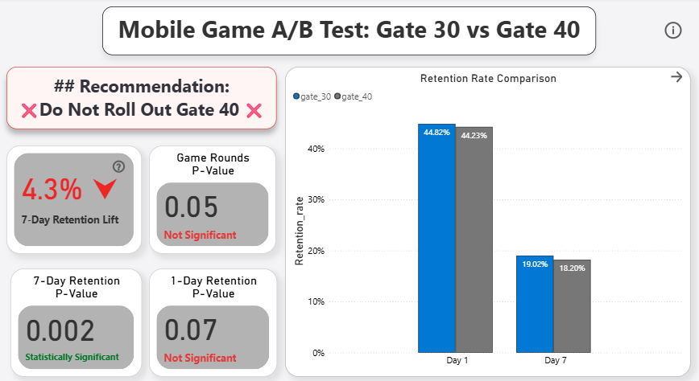
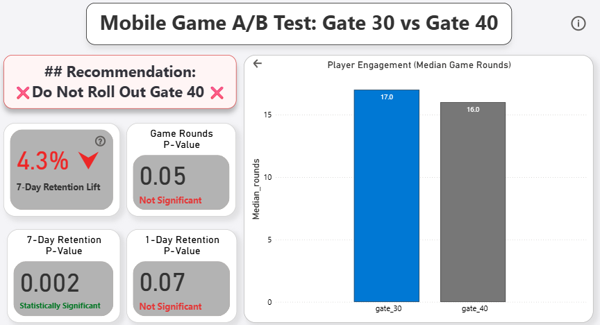

# PlayGate Progression Gating — A/B Test Analysis  
*Gate 30 vs Gate 40*

> *When a statistically significant metric is not sufficient to justify shipping.*

> Product Analytics | Experimentation | Decision Ownership

---

## ⚡ Executive Snapshot

**Problem**  
The game design team proposed moving the progression gate from **Level 30 to Level 40** to increase long-term player retention.

**Decision**  
❌ **Do Not Roll Out Gate 40.**

**Why**  
Although Gate 30 showed a statistically significant improvement in **7-day retention**, the change did **not improve player engagement** and introduced meaningful progression-friction risk. For a core progression mechanic, a partial metric win is not enough.

**Bottom Line**  
Shipping Gate 40 would optimize for a single metric while degrading the overall player experience.

---

## 📊 Dashboard Summary

> *Executive view of engagement, retention, and final recommendation*

<p align="center">
  
  
</p>

---

## 🏢 Business Context

This project is framed around **PlayGate**, a fictional mobile gaming company operating a casual, level-based game with monetization and retention sensitivity tied directly to player progression pacing.

Progression gates are **high-leverage mechanics**:
- They strongly influence early- and mid-game drop-off
- Small increases in friction can permanently reduce lifetime value
- Retention gains must be evaluated alongside engagement health

My role was to evaluate whether delaying progression access (Gate 40) should replace the existing Gate 30 experience.

---

## 🎯 Objective & Hypotheses

### Objective  
Evaluate whether moving the progression gate from **Level 30 to Level 40** improves player outcomes without harming engagement.

### Hypotheses

- **H₀ (Null):**  
  Gate 40 does not improve player outcomes relative to Gate 30.

- **H₁ (Alternative):**  
  Gate 40 improves player outcomes (retention and/or engagement).

This experiment was evaluated across **multiple metrics**, not a single success criterion.

---

## 🧪 Experiment Details

- **Experiment Type:** Randomized A/B Test  
- **Variants:**  
  - Control: Gate 30  
  - Treatment: Gate 40  

### Sample Size
- **Gate 30:** 44,699 users  
- **Gate 40:** 45,489 users  
- **Total:** 90,188 users  

The traffic split was balanced, indicating **no Sample Ratio Mismatch (SRM)**.

---

## 🔍 Metrics & Methodology

### Engagement Metric
- **Metric:** Total game rounds played  
- **Distribution:** Heavily right-skewed  
- **Statistical Test:** Mann–Whitney U test (median-based)

> Mean-based tests were explicitly avoided to prevent distortion from extreme outliers.

### Retention Metrics
- **Day-1 Retention:** Z-test for proportions  
- **Day-7 Retention:** Z-test for proportions  

Each metric was evaluated independently, then interpreted **together** for the final decision.

---

## 📊 Results Summary

### Engagement (Primary Progression Signal)
- **Median game rounds:** No statistically significant difference  
- **p-value:** ~0.05  
- **Interpretation:** Gate 40 did not improve engagement or progression depth

### Retention
- **Day-1 Retention:**  
  - Not statistically significant (p ≈ 0.07)

- **Day-7 Retention:**  
  - Statistically significant improvement for **Gate 30**  
  - **Lift:** ~4.3%  
  - **p-value:** ~0.002

---

## 📌 Decision Rationale

This experiment produced **conflicting signals**, which is where judgment matters most.

- Gate 30 showed a **clear Day-7 retention advantage**
- Gate 40 showed **no engagement improvement**
- Introducing later gating increases perceived friction and progression risk

For a core gameplay mechanic, **retention gains must be supported by healthy engagement**. Optimizing retention alone, without reinforcing engagement, risks long-term player dissatisfaction and churn.

**Decision:** ❌ **Do Not Roll Out Gate 40**

---

## 🔍 Post-Test Diagnostics & Guardrails

A senior experiment does not stop at statistical significance.

Recommended follow-up analyses included:
- Stage-level drop-off analysis around the gate boundary  
- Segment-level impact (new vs returning players)  
- Monetization and session-length guardrails  

Even with positive retention, any evidence of:
- Increased frustration signals  
- Shorter session depth  
- Early-game abandonment  

would independently block rollout for a progression system.

---

## 📂 Repository Structure
```
mobile-game-gating-ab-test/
│
├── data/ # Raw experiment dataset
├── sql/ # Assignment validation and metric aggregation
├── python/ # Statistical analysis and test selection
├── powerbi/ # Executive dashboard
├── images/ # Dashboard visuals
└── README.md
```

---

## 🛠️ Tech Stack

- **SQL** — experiment integrity checks and aggregation  
- **Python** — non-parametric testing and retention analysis  
- **Power BI** — executive-level decision reporting  

---

## ⚠️ Limitations

- No long-term LTV modeling  
- No qualitative player feedback  
- Single-experiment snapshot  

These constraints do not weaken the decision, given the risk profile of progression changes.

---

## 📣 Final Note

This project highlights a critical product lesson:

> A statistically significant metric is not the same as a shippable decision.

Strong product leadership requires resisting partial wins when system-level risk remains high.

